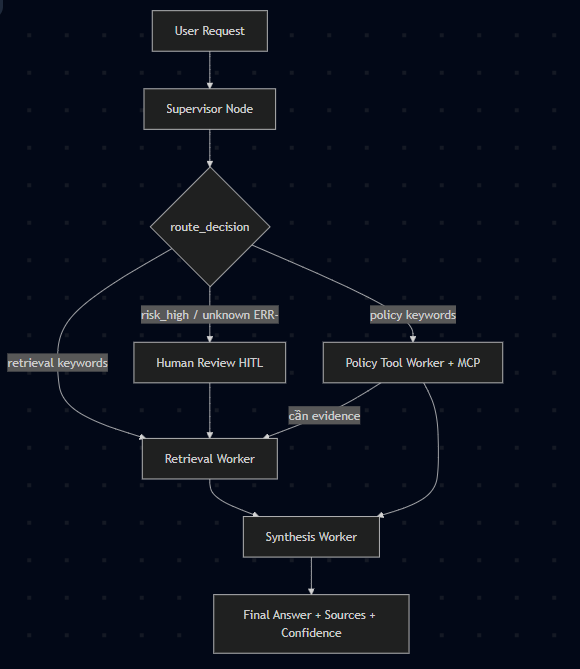

# System Architecture — Lab Day 09

**Nhóm:** Nhóm-03-E402  
**Ngày:** 14/04/2026  
**Version:** 1.0

---

## 1. Tổng quan kiến trúc

> Mô tả ngắn hệ thống của nhóm: chọn pattern gì, gồm những thành phần nào.

**Pattern đã chọn:** Supervisor-Worker  
**Lý do chọn pattern này (thay vì single agent):**
- Tách biệt rõ ràng trách nhiệm (Separation of Concerns) → dễ debug, test và maintain.
- Supervisor có khả năng routing thông minh dựa trên keyword + risk assessment.
- Dễ mở rộng capability mới qua MCP tools mà không cần sửa core prompt.
- Hỗ trợ Human-in-the-Loop (HITL) cho các trường hợp risk cao.
- Tăng transparency qua route_reason và trace chi tiết.

_________________

---

## 2. Sơ đồ Pipeline

> Vẽ sơ đồ pipeline dưới dạng text, Mermaid diagram, hoặc ASCII art.
> Yêu cầu tối thiểu: thể hiện rõ luồng từ input → supervisor → workers → output.

**Ví dụ (ASCII art):**
```
User Request
     │
     ▼
┌──────────────┐
│  Supervisor  │  ← route_reason, risk_high, needs_tool
└──────┬───────┘
       │
   [route_decision]
       │
  ┌────┴────────────────────┐
  │                         │
  ▼                         ▼
Retrieval Worker     Policy Tool Worker
  (evidence)           (policy check + MCP)
  │                         │
  └─────────┬───────────────┘
            │
            ▼
      Synthesis Worker
        (answer + cite)
            │
            ▼
         Output
```

**Sơ đồ thực tế của nhóm:**



---

## 3. Vai trò từng thành phần

### Supervisor (`graph.py`)

| Thuộc tính | Mô tả |
|-----------|-------|
| **Nhiệm vụ** | Phân tích task, quyết định route, đánh giá risk và nhu cầu tool |
| **Input** | task (câu hỏi người dùng) |
| **Output** | supervisor_route, route_reason, risk_high, needs_tool |
| **Routing logic** | Dựa trên keyword matching + regex (policy_keywords, retrieval_keywords, risk_keywords, unknown_err_re) |
| **HITL condition** | Risk cao + unknown error code (ERR-xxx) |

### Retrieval Worker (`workers/retrieval.py`)

| Thuộc tính | Mô tả |
|-----------|-------|
| **Nhiệm vụ** | Truy xuất evidence từ ChromaDB |
| **Embedding model** | OpenAI text-embedding-3-small (dense) + BM25 + Underthesea (sparse) |
| **Top-k** | 3 (mặc định) |
| **Stateless?** | Yes |

### Policy Tool Worker (`workers/policy_tool.py`)

| Thuộc tính | Mô tả |
|-----------|-------|
| **Nhiệm vụ** | Kiểm tra policy + gọi MCP tools khi cần |
| **MCP tools gọi** | search_kb, get_ticket_info, check_access_permission, create_ticket |
| **Exception cases xử lý** | Flash Sale, Digital/License, Activated product, Policy version v3/v4 |

### Synthesis Worker (`workers/synthesis.py`)

| Thuộc tính | Mô tả |
|-----------|-------|
| **LLM model** | gpt-4o-mini |
| **Temperature** | 0.1 |
| **Grounding strategy** | System prompt nghiêm ngặt + context rõ ràng + citation bắt buộc |
| **Abstain condition** | Không có chunk hoặc LLM trả lời "Không đủ thông tin" |

### MCP Server (`mcp_server.py`)

| Tool | Input | Output |
|------|-------|--------|
| search_kb | query, top_k | chunks, sources |
| get_ticket_info | ticket_id | ticket details |
| check_access_permission | access_level, requester_role | can_grant, approvers |
| create_ticket | priority, title, description | mock ticket |

---

## 4. Shared State Schema

> Liệt kê các fields trong AgentState và ý nghĩa của từng field.

| Field              | Type   | Mô tả                              | Ai đọc/ghi                     |
|--------------------|--------|-------------------------------------|--------------------------------|
| task               | str    | Câu hỏi đầu vào                     | Supervisor                     |
| supervisor_route   | str    | Worker được chọn                    | Supervisor                     |
| route_reason       | str    | Lý do routing (trace)               | Supervisor                     |
| risk_high          | bool   | Cờ risk cao → HITL                  | Supervisor                     |
| needs_tool         | bool   | Có cần gọi MCP không                | Supervisor                     |
| retrieved_chunks   | list   | Evidence từ retrieval               | Retrieval → Synthesis          |
| retrieved_sources  | list   | Danh sách nguồn                     | Retrieval                      |
| policy_result      | dict   | Kết quả phân tích policy + exceptions | Policy Tool → Synthesis     |
| mcp_tools_used     | list   | Lịch sử tool calls                  | Policy Tool                    |
| final_answer       | str    | Câu trả lời cuối cùng               | Synthesis                      |
| sources            | list   | Nguồn được cite                    | Synthesis                      |
| confidence         | float  | Mức độ tin cậy (0.0 - 1.0)         | Synthesis                      |
| history            | list   | Trace chi tiết từng bước            | Toàn graph                     |
| workers_called     | list   | Danh sách worker đã chạy            | Toàn graph                     |
| hitl_triggered     | bool   | Đã trigger human review             | Human Review                   |
| run_id             | str    | ID trace                            | Graph                          |

---

## 5. Lý do chọn Supervisor-Worker so với Single Agent (Day 08)

| Tiêu chí               | Single Agent (Day 08)        | Supervisor-Worker (Day 09)                          |
|------------------------|------------------------------|-----------------------------------------------------|
| Debug khi sai          | Khó                          | Dễ (test từng worker độc lập)                      |
| Thêm capability mới    | Sửa toàn prompt              | Thêm MCP tool hoặc worker mới                      |
| Routing visibility     | Không có                     | Có `route_reason` rõ ràng                          |
| Human-in-the-Loop      | Khó implement                | Hỗ trợ native qua `human_review_node`              |
| Trace & Observability  | Thấp                         | Cao (`worker_io_logs`, `history`, `mcp_tools_used`)|
| Maintainability        | Thấp                         | Cao                                                |

**Nhóm điền thêm quan sát từ thực tế lab:**

- Routing chính xác cao với keyword matching.
- Hybrid retrieval cải thiện đáng kể chất lượng evidence so với pure dense.
- MCP giúp tách biệt logic tool khỏi core agent → rất dễ mở rộng.
- Confidence scoring kết hợp heuristic + LLM evaluation cho kết quả ổn định.

_________________

---

## 6. Giới hạn và điểm cần cải tiến

> Nhóm mô tả những điểm hạn chế của kiến trúc hiện tại.

1. Embedding model phụ thuộc OpenAI → nên có fallback local (Sentence-Transformers) để giảm chi phí.
2. Chưa có retry mechanism và tool calling loop (agent có thể gọi nhiều tool liên tiếp).
3. Evaluation còn thủ công → cần thêm automated scoring pipeline.

