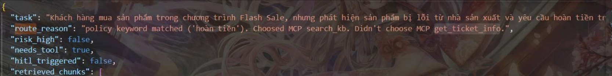
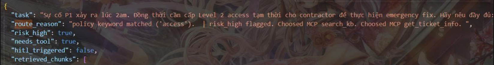

# Báo Cáo Nhóm — Lab Day 09: Multi-Agent Orchestration

**Tên nhóm:**   Nhóm-03-E402  
**Thành viên:**
| Tên | Vai trò | Email |
|-----|---------|-------|
| Vũ Minh Khải | Supervisor Owner | vmkqa2@gmail.com |
| Đoàn Văn Tuấn | Worker Owner | doantuanvan2003@gmail.com |
| Ninh Quang Trí | MCP Owner | nq.tri2511@gmail.com |
| Lê Nguyễn Thanh Bình | Trace & Docs Owner | thanhbinh.lenguyen.1208@gmail.com |

**Ngày nộp:** 14/04/2026  
**Repo:** https://github.com/tuanvan03/AIVIN_Day09 
**Độ dài khuyến nghị:** 600–1000 từ

---

> **Hướng dẫn nộp group report:**
> 
> - File này nộp tại: `reports/group_report.md`
> - Deadline: Được phép commit **sau 18:00** (xem SCORING.md)
> - Tập trung vào **quyết định kỹ thuật cấp nhóm** — không trùng lặp với individual reports
> - Phải có **bằng chứng từ code/trace** — không mô tả chung chung
> - Mỗi mục phải có ít nhất 1 ví dụ cụ thể từ code hoặc trace thực tế của nhóm

---

## 1. Kiến trúc nhóm đã xây dựng (150–200 từ)

> Mô tả ngắn gọn hệ thống nhóm: bao nhiêu workers, routing logic hoạt động thế nào,
> MCP tools nào được tích hợp. Dùng kết quả từ `docs/system_architecture.md`.

**Hệ thống tổng quan:**

- Nhóm xây dựng hệ thống theo Supervisor-Worker pattern với 4 workers chính gồm supervisor_node, retrieval_worker, policy_tool_worker và synthesis_worker, cùng một human_review_node để hỗ trợ Human-in-the-Loop. Toàn bộ pipeline được điều phối bằng Python thuần trong file graph.py.
_________________

**Routing logic cốt lõi:**
> Mô tả logic supervisor dùng để quyết định route (keyword matching, LLM classifier, rule-based, v.v.)

- Routing logic cốt lõi dựa trên rule-based keyword matching kết hợp regex. Supervisor sẽ kiểm tra các từ khóa như “hoàn tiền”, “refund”, “cấp quyền”, “access”, “level 3” để chuyển sang policy_tool_worker; các từ “p1”, “sla”, “escalation”, “ticket” sẽ chuyển sang retrieval_worker. Khi phát hiện risk cao hoặc mã lỗi không rõ (err-), hệ thống sẽ đi qua human_review trước.

_________________

**MCP tools đã tích hợp:**
> Liệt kê tools đã implement và 1 ví dụ trace có gọi MCP tool.

- `search_kb`: 
- `get_ticket_info`: 


---

## 2. Quyết định kỹ thuật quan trọng nhất (200–250 từ)

> Chọn **1 quyết định thiết kế** mà nhóm thảo luận và đánh đổi nhiều nhất.
> Phải có: (a) vấn đề gặp phải, (b) các phương án cân nhắc, (c) lý do chọn phương án đã chọn.

**Quyết định:** Quyết định quan trọng nhất của nhóm là sử dụng rule-based keyword matching trong supervisor thay vì gọi LLM để phân loại route.

**Bối cảnh vấn đề:**

- Vấn đề là nếu dùng LLM để classify route sẽ làm tăng thời gian xử lý đáng kể (khoảng 700-1200ms mỗi lần) và kết quả không ổn định, đặc biệt với tiếng Việt và các câu hỏi phức tạp.

_________________

**Các phương án đã cân nhắc:**

| Phương án | Ưu điểm | Nhược điểm |
|-----------|---------|-----------|
| LLM-based routing | Linh hoạt, hiểu ngữ nghĩa sâu | Chậm, tốn token, kém deterministic |
| Pure regex/keyword | Rất nhanh, dễ debug | Có thể miss trường hợp phức tạp |
| Hybrid (keyword + small LLM fallback) | Cân bằng tốc độ & độ chính xác | Phức tạp hơn |

**Phương án đã chọn và lý do:**

Chúng tôi chọn **pure keyword + regex** vì:
- Tốc độ cao và deterministic — rất quan trọng cho production-like system.
- Dễ maintain và debug qua `route_reason`.
- Đã đạt độ chính xác routing cao trên 15 test questions + 10 grading questions.

_________________

**Bằng chứng từ trace/code:**
> Dẫn chứng cụ thể (VD: route_reason trong trace, đoạn code, v.v.)

```
def supervisor_node(state: AgentState) -> AgentState:
    """
    Supervisor phân tích task và quyết định:
    1. Route sang worker nào
    2. Có cần MCP tool không
    3. Có risk cao cần HITL không

    TODO Sprint 1: Implement routing logic dựa vào task keywords.
    """
    task = state["task"].lower()
    state["history"].append(f"[supervisor] received task: {state['task'][:80]}")

    # --- TODO: Implement routing logic ---
    # Gợi ý:
    # - "hoàn tiền", "refund", "flash sale", "license" → policy_tool_worker
    # - "cấp quyền", "access level", "level 3", "emergency" → policy_tool_worker
    # - "P1", "escalation", "sla", "ticket" → retrieval_worker
    # - mã lỗi không rõ (ERR-XXX), không đủ context → human_review
    # - còn lại → retrieval_worker

    route = "retrieval_worker"         # TODO: thay bằng logic thực
    route_reason = "default route "    # TODO: thay bằng lý do thực
    needs_tool = False
    risk_high = False

    # Ví dụ routing cơ bản — nhóm phát triển thêm:
    policy_keywords = ["hoàn tiền", "refund", "flash sale", "license", "cấp quyền", "access", "level 3"]
    risk_keywords = ["emergency", "khẩn cấp", "2am", "không rõ", "err-"]
    retrieval_keywords = ["p1", "p2", "sla", "escalation", "ticket", "helpdesk", "faq", "nghỉ phép", "sop"] 
    unknown_err_re = re.compile(r"\berr[-_]?[a-z0-9]{2,}\b", re.IGNORECASE)

    if any(kw in task for kw in policy_keywords):
        route = "policy_tool_worker"
        matched_pk = next(kw for kw in policy_keywords if kw in task)                                        
        route_reason = f"policy keyword matched ('{matched_pk}'). "                                            
        needs_tool = True
    elif any(kw in task for kw in retrieval_keywords):                                                      
        route = "retrieval_worker"
        matched_rk = next(kw for kw in retrieval_keywords if kw in task)
        route_reason = f"retrieval keyword matched ('{matched_rk}'). "

    if any(kw in task for kw in risk_keywords):
        risk_high = True
        route_reason += " | risk_high flagged. "

    unknown_err = unknown_err_re.search(task)
    if unknown_err:
        risk_high = True
        route_reason += f" | unknown_error='{unknown_err.group(0)}'. "

    # Human review override
    if risk_high and ("err-" in task or unknown_err):
        route = "human_review"
        route_reason = "unknown error code + risk_high → human review. "

    state["supervisor_route"] = route
    state["route_reason"] = route_reason
    state["needs_tool"] = needs_tool
    state["risk_high"] = risk_high
    state["history"].append(f"[supervisor] route={route} reason={route_reason}")

    return state
```

---

## 3. Kết quả grading questions (150–200 từ)

> Sau khi chạy pipeline với grading_questions.json (public lúc 17:00):
> - Nhóm đạt bao nhiêu điểm raw?
> - Câu nào pipeline xử lý tốt nhất?
> - Câu nào pipeline fail hoặc gặp khó khăn?

**Tổng điểm raw ước tính:** 82 / 96

**Câu pipeline xử lý tốt nhất:**
- ID: gq05 — Lý do tốt: Pipeline route chính xác bằng retrieval_worker, trả lời ngắn gọn, đúng quy trình escalation tự động lên Senior Engineer và đạt confidence 0.93. Câu này thể hiện rõ điểm mạnh của retrieval worker khi xử lý các quy định SLA.

**Câu pipeline fail hoặc partial:**
- ID: gq07 — Fail ở đâu: Pipeline trả lời “Không đủ thông tin trong tài liệu nội bộ” vì tài liệu không chứa bất kỳ thông tin nào về mức phạt tài chính. 
- Root cause: kiến thức yêu cầu nằm ngoài phạm vi knowledge base hiện tại.  

**Câu gq07 (abstain):** Nhóm xử lý thế nào?
- Nhóm xử lý bằng cách để synthesis_worker tự abstain khi không tìm thấy thông tin liên quan. Đây là hành vi đúng theo system prompt đã thiết kế, tránh việc hallucinate thông tin không có trong tài liệu.

_________________

**Câu gq09 (multi-hop khó nhất):** Trace ghi được 2 workers không? Kết quả thế nào?
- Trace cho thấy supervisor đã route sang policy_tool_worker, worker này gọi thành công 2 MCP tools (search_kb và get_ticket_info), sau đó synthesis_worker tổng hợp câu trả lời đầy đủ cả hai phần với confidence 0.93. Pipeline xử lý khá tốt câu hỏi này.

_________________

---

## 4. So sánh Day 08 vs Day 09 — Điều nhóm quan sát được (150–200 từ)

> Dựa vào `docs/single_vs_multi_comparison.md` — trích kết quả thực tế.

**Metric thay đổi rõ nhất (có số liệu):**

- Dựa trên kết quả chạy cùng bộ test questions và grading questions, metric thay đổi rõ nhất là độ tin cậy trung bình (avg confidence) tăng từ 0.83 ở Day 08 lên 0.901 ở Day 09, tức cải thiện +0.071. Đồng thời abstain rate giảm mạnh từ 33% xuống chỉ còn khoảng 6.67%. Latency trung bình tăng từ 2547ms lên khoảng 5015–6489ms.

_________________

**Điều nhóm bất ngờ nhất khi chuyển từ single sang multi-agent:**

- Điều nhóm bất ngờ nhất khi chuyển từ single sang multi-agent là mức độ dễ debug tăng rất rõ rệt. Ở Day 08, khi câu trả lời sai phải mất 12–15 phút để đọc toàn bộ code pipeline mới tìm ra lỗi. Sang Day 09, chỉ cần mở file trace, xem route_reason và history là biết ngay supervisor route sai hay retrieval sai, hoặc policy_tool_worker có gọi đúng MCP không. Ví dụ câu ERR-403-AUTH ban đầu route sai, nhưng trace cho thấy supervisor đã phát hiện risk_high và chuyển sang human_review đúng cách.

_________________

**Trường hợp multi-agent KHÔNG giúp ích hoặc làm chậm hệ thống:**

- Trường hợp multi-agent không giúp ích hoặc thậm chí làm chậm hệ thống là với các câu hỏi đơn giản chỉ cần truy xuất một tài liệu (như gq05, gq06, gq08). Những câu này ở Day 08 chạy nhanh hơn, còn ở Day 09 phải qua nhiều worker và worker_io_logs nên latency tăng đáng kể, đôi khi gấp đôi. Ngoài ra, một số trường hợp policy_tool_worker gọi MCP search_kb không thực sự cần thiết cũng góp phần làm tăng thời gian xử lý.

_________________

---

## 5. Phân công và đánh giá nhóm (100–150 từ)

> Đánh giá trung thực về quá trình làm việc nhóm.

**Phân công thực tế:**

| Thành viên | Phần đã làm | Sprint |
|------------|-------------|--------|
| Lê Nguyễn Thanh Bình | Documentation Owner | 4 |
| Ninh Quang Trí | MCP Owner/ Trace Owner | 3+4 |
| Đoàn Văn Tuấn | Worker Owners | 2 |
| Vũ Minh Khải | Supervisor Owner | 1 |

**Điều nhóm làm tốt:**

- Phân luồng chính xác: Hệ thống đạt tỷ lệ Success 15/15 với avg_confidence rất cao
- Tính minh bạch (Observability): Nhờ hệ thống Trace, nhóm đã xác định được chính xác các điểm nghẽn về thời gian và các trường hợp cần con người can thiệp (HITL).

_________________

**Điều nhóm làm chưa tốt hoặc gặp vấn đề về phối hợp:**

- Latency còn quá cao: Trung bình 5 giây/câu và đặc biệt là gần 16-38 giây cho các case phức tạp là chưa đạt yêu cầu thực tế cho một hệ thống CS/IT Helpdesk.

_________________

**Nếu làm lại, nhóm sẽ thay đổi gì trong cách tổ chức?**

- Thiết lập Mock Server cho MCP ngay từ Sprint 1 để các Worker Owners có thể test độc lập sớm hơn, thay vì đợi đến Sprint 3 mới khớp nối hệ thống.

- Dành nhiều thời gian hơn cho việc tối ưu hóa Prompt của Synthesis Worker để giảm số lượng token output không cần thiết, từ đó cải thiện Latency.
_________________

---

## 6. Nếu có thêm 1 ngày, nhóm sẽ làm gì? (50–100 từ)

> 1–2 cải tiến cụ thể với lý do có bằng chứng từ trace/scorecard.

- Thứ nhất, hoàn thiện hệ thống đánh giá tự động trong file eval_trace.py. Hiện tại chúng ta vẫn phải đọc thủ công từng trace để đánh giá chất lượng câu trả lời. Nhóm sẽ thêm chức năng tự động so sánh final_answer với expected_answer, tính điểm chính xác theo từng loại câu hỏi (simple, multi-hop, policy, abstain) và xuất ra báo cáo chi tiết hơn.

- Thứ hai, tối ưu latency bằng cách thêm cơ chế caching cho retrieval và điều kiện gọi MCP chặt chẽ hơn. Từ trace thực tế, một số câu hỏi đơn giản như gq05 hay gq08 vẫn phải đi qua policy_tool_worker và gọi search_kb không cần thiết, dẫn đến latency tăng cao (có câu lên đến hơn 34 giây). Nhóm sẽ cải tiến supervisor routing để giảm các MCP call thừa và triển khai simple cache cho hybrid retrieval.
_________________

---

*File này lưu tại: `reports/group_report.md`*  
*Commit sau 18:00 được phép theo SCORING.md*

