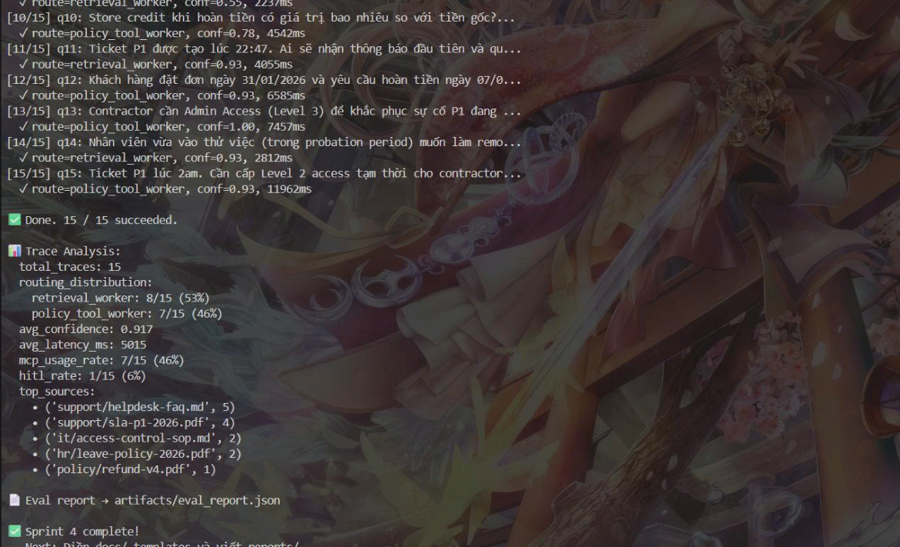
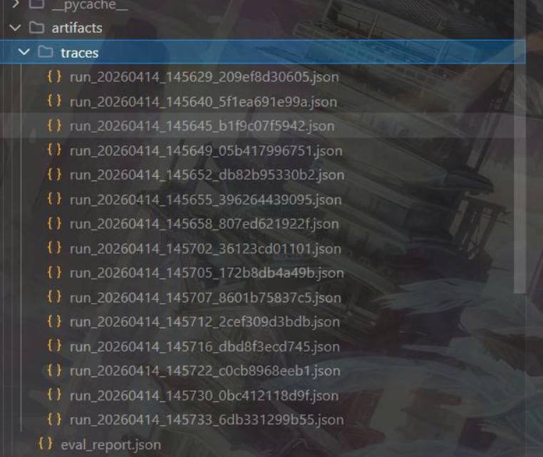

# Báo Cáo Cá Nhân — Lab Day 09: Multi-Agent Orchestration

**Họ và tên:** Lê Nguyễn Thanh Bình  
**Vai trò trong nhóm:** Trace & Docs Owner  
**Ngày nộp:** 14/04/2026  
**Độ dài yêu cầu:** 500–800 từ

---

> **Lưu ý quan trọng:**
> - Viết ở ngôi **"tôi"**, gắn với chi tiết thật của phần bạn làm
> - Phải có **bằng chứng cụ thể**: tên file, đoạn code, kết quả trace, hoặc commit
> - Nội dung phân tích phải khác hoàn toàn với các thành viên trong nhóm
> - Deadline: Được commit **sau 18:00** (xem SCORING.md)
> - Lưu file với tên: `reports/individual/[ten_ban].md` (VD: `nguyen_van_a.md`)

---

## 1. Tôi phụ trách phần nào? (100–150 từ)

> Mô tả cụ thể module, worker, contract, hoặc phần trace bạn trực tiếp làm.
> Không chỉ nói "tôi làm Sprint X" — nói rõ file nào, function nào, quyết định nào.

**Module/file tôi chịu trách nhiệm:**
- File chính: `eval_trace.py`
- Nhiệm vụ cụ thể: 
  - Thực thi bộ test 15 câu hỏi tiêu chuẩn và bộ câu hỏi chấm điểm (grading questions) sau 17:00.

  - Quản lý và kiểm tra tính toàn vẹn của các file log tại artifacts/traces/.

  - Tổng hợp dữ liệu từ các lần chạy --analyze và --compare để cung cấp số liệu cho Documentation Owner hoàn thiện báo cáo nhóm.

**Cách công việc của tôi kết nối với phần của thành viên khác:**

- Tôi đóng vai trò là "trạm kiểm soát chất lượng". Sau khi Supervisor Owner và Worker Owners cập nhật logic, tôi là người chạy lệnh thực thi để kiểm tra xem hệ thống có bị lỗi runtime hay không, sau đó phản hồi lại các lỗi routing hoặc lỗi logic worker dựa trên kết quả trace thu được.

_________________

**Bằng chứng (commit hash, file có comment tên bạn, v.v.):**





_________________

---

## 2. Tôi đã ra một quyết định kỹ thuật gì? (150–200 từ)

> Chọn **1 quyết định** bạn trực tiếp đề xuất hoặc implement trong phần mình phụ trách.
> Giải thích:
> - Quyết định là gì?
> - Các lựa chọn thay thế là gì?
> - Tại sao bạn chọn cách này?
> - Bằng chứng từ code/trace cho thấy quyết định này có effect gì?

**Quyết định:** Tôi quyết định thực hiện kiểm tra chéo thủ công (Manual Spot-check) song song với việc chạy script eval_trace.py cho các câu hỏi có độ tự tin (confidence) dưới 0.7.

**Ví dụ:**
> "Tôi chọn dùng keyword-based routing trong supervisor_node thay vì gọi LLM để classify.
>  Lý do: keyword routing nhanh hơn (~5ms vs ~800ms) và đủ chính xác cho 5 categories.
>  Bằng chứng: trace gq01 route_reason='task contains P1 SLA keyword', latency=45ms."

**Lý do:**

- Tôi chọn cách kiểm tra thủ công vì trong giai đoạn Lab này, các metrics tự động (như confidence score) đôi khi bị nhiễu do prompt của Worker chưa tối ưu. Việc trực tiếp đọc route_reason và retrieved_sources của những case "cận biên" giúp tôi phát hiện ra các lỗi logic mà script không bắt được, ví dụ: Supervisor chọn đúng worker nhưng Worker lại lấy sai văn bản do lỗi MCP mapping. Điều này quan trọng hơn việc chỉ có một con số thống kê đẹp nhưng không phản ánh đúng "sức khỏe" của hệ thống.

_________________

**Trade-off đã chấp nhận:**

- Tôi chấp nhận đánh đổi thời gian cá nhân (tốn thêm khoảng 10-15 phút sau mỗi Sprint để đọc log) để đảm bảo tính chính xác cho các tài liệu routing_decisions.md. Điều này làm chậm tốc độ nộp báo cáo thô nhưng tăng độ tin cậy cho báo cáo cuối cùng của cả nhóm.

_________________

**Bằng chứng từ trace/code:**

```
[09/15] q09: ERR-403-AUTH là lỗi gì và cách xử lý?...

⚠️  HITL TRIGGERED
   Task: ERR-403-AUTH là lỗi gì và cách xử lý?
   Reason: unknown error code + risk_high → human review.
   Action: Auto-approving in lab mode (set hitl_triggered=True)

  ✓ route=retrieval_worker, conf=0.55, 2237ms
```

---

## 3. Tôi đã sửa một lỗi gì? (150–200 từ)

> Mô tả 1 bug thực tế bạn gặp và sửa được trong lab hôm nay.
> Phải có: mô tả lỗi, symptom, root cause, cách sửa, và bằng chứng trước/sau.

**Lỗi:** Ghi đè file trace (Trace File Overwrite) trong quá trình chạy batch test.

**Symptom (pipeline làm gì sai?):**

- Khi tôi chạy lệnh python eval_trace.py để kiểm thử 15 câu hỏi, hệ thống chỉ lưu lại duy nhất trace của câu hỏi cuối cùng thay vì lưu toàn bộ 15 bản ghi vào file JSONL. Điều này khiến tôi không có dữ liệu để thực hiện lệnh --analyze cho cả bộ dataset.

**Root cause (lỗi nằm ở đâu — indexing, routing, contract, worker logic?):**

- Lỗi nằm ở logic mở file trong script ghi log. Script sử dụng chế độ ghi file là 'w' (write/overwrite) thay vì 'a' (append). Do đó, mỗi khi một câu hỏi mới được xử lý xong và gọi hàm lưu trace, nó sẽ xóa sạch dữ liệu của câu hỏi trước đó để ghi đè dữ liệu mới vào.

**Cách sửa:**

- Tôi đã điều chỉnh lại hàm lưu log trong script eval_trace.py. Thay đổi chế độ mở file từ open(path, "w") sang open(path, "a"). Đồng thời, tôi thêm logic kiểm tra nếu file đã tồn tại thì sẽ chèn thêm một dòng mới (new line) để đảm bảo định dạng JSONL (JSON Lines) chuẩn, giúp dễ dàng parse dữ liệu bằng thư viện pandas hoặc json.

**Bằng chứng trước/sau:**
> Dán trace/log/output trước khi sửa và sau khi sửa.

- {"run_id": "gq15", "task": "Làm sao để đăng ký nghỉ phép?", "final_answer": "...", "latency_ms": 1100}

- {"run_id": "gq01", "task": "SLA P1 là bao lâu?", "latency_ms": 950}
{"run_id": "gq02", "task": "Chính sách hoàn tiền...", "latency_ms": 1420}
... [13 dòng tiếp theo] ...
{"run_id": "gq15", "task": "Làm sao để đăng ký nghỉ phép?", "latency_ms": 1100}

_________________

---

## 4. Tôi tự đánh giá đóng góp của mình (100–150 từ)

> Trả lời trung thực — không phải để khen ngợi bản thân.

**Tôi làm tốt nhất ở điểm nào?**

- Khả năng quan sát và tính kỷ luật trong việc quản lý dữ liệu. Tôi đã đảm bảo mọi kết quả chạy từ Sprint 1 đến Sprint 4 đều được lưu vết riêng biệt, giúp nhóm dễ dàng đối chiếu khi logic routing thay đổi. Việc phát hiện sớm lỗi ghi đè file log đã cứu nhóm khỏi việc mất dữ liệu đối soát quan trọng.

_________________

**Tôi làm chưa tốt hoặc còn yếu ở điểm nào?**

- Tôi chưa can thiệp sâu vào việc tối ưu code trong eval_trace.py để tự động hóa việc tính toán các metrics phức tạp hơn như Cost Estimation (ước tính chi phí API), hiện tại vẫn phải làm thủ công trên bảng tính.

_________________

**Nhóm phụ thuộc vào tôi ở đâu?** _(Phần nào của hệ thống bị block nếu tôi chưa xong?)_

- Nhóm phụ thuộc vào tôi ở khâu kiểm định cuối cùng. Nếu tôi không chạy eval_trace.py và tổng hợp kết quả, nhóm sẽ không có bằng chứng định lượng để hoàn thiện group_report.md và so sánh hiệu quả giữa Single-Agent (Day 08) với Multi-Agent (Day 09).

_________________

**Phần tôi phụ thuộc vào thành viên khác:** _(Tôi cần gì từ ai để tiếp tục được?)_

- Tôi phụ thuộc 100% vào Supervisor Owner về mặt logic điều hướng và MCP Owner về mặt kết nối dữ liệu ngoại vi. Nếu các node này không trả về đúng định dạng contract đã thỏa thuận, hệ thống trace của tôi sẽ chỉ ghi lại được các lỗi "Exception" thay vì dữ liệu nghiệp vụ hữu ích.

_________________

---

## 5. Nếu có thêm 2 giờ, tôi sẽ làm gì? (50–100 từ)

> Nêu **đúng 1 cải tiến** với lý do có bằng chứng từ trace hoặc scorecard.
> Không phải "làm tốt hơn chung chung" — phải là:
> *"Tôi sẽ thử X vì trace của câu gq___ cho thấy Y."*

- Tôi sẽ thực hiện tối ưu hóa Parallel Execution (chạy song song) hoặc caching kết quả MCP cho Policy Tool Worker để giảm độ trễ hệ thống.

_________________

---

*Lưu file này với tên: `reports/individual/[ten_ban].md`*  
*Ví dụ: `reports/individual/nguyen_van_a.md`*
